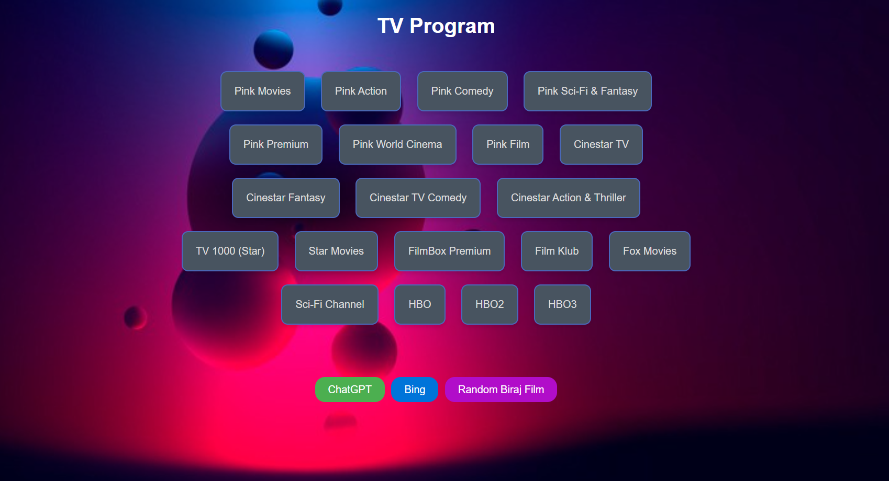

# TV Program Web Page

This project is a simple web page that displays a list of TV programs from various Serbian channels. The page is styled with a cool background image and has a user-friendly interface.

## Code Structure

The project consists of an HTML file and a CSS file.

### HTML

The HTML file (`index.html`) contains the structure of the web page. It includes a header with the title of the page and a section that lists the TV programs. Each program is represented as a link inside a styled div element.

### CSS

The CSS file (`styles.css`) provides the styling for the web page. It includes styles for the body, container, header, program list, link boxes, and buttons. The CSS file also includes hover effects for the link boxes and buttons.

## Usage

To view the web page, open the `index.html` file in a web browser. You will see a list of TV programs. Click on a program to view its details.

## Customization

You can customize the web page by modifying the HTML and CSS files. For example, you can change the background image by replacing the URL in the `background-image` property in the CSS file. You can also add more programs by adding more link boxes in the HTML file.

## Look of web page:

